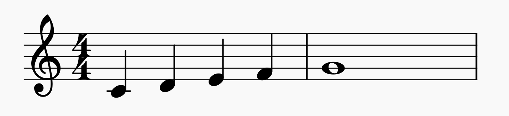

### Composing Music with Haskell

>​																								:= By Raptazure


Quick Sort in Haskell (Although syntax isn't that important for a PL...)

```haskell
-- Type annotation
quickSort :: Ord a => [a] -> [a]

-- Using filter
quickSort [] = []
quickSort (x:xs) = quickSort (filter (<x) xs)
                  ++ [x] ++
                  quickSort (filter (>=x) xs)
```

##### Why Haskell?

1. Purely functional.

   - Composition & Abstraction.
   - Flow of data  =>  Flow of notes.
   - Immutable data  =>  make parallelism easier => harmonic composition.

2. Lazy evaluation. 

   - Infinite things works better ... 
   - Maybe for atmosphere / contemporary music (∞ version).

3. Statically typed.

   - Type checker  =>  Spell checker for music.

   - Expressive type system  =>  Rules of music composition as types.

     

##### But How?

1. Mezzo
	> *Mezzo* is a Haskell library and embedded domain-specific  language for music description. Its novelty is in the fact that it can  enforce various rules of music composition *statically*, that is, at compile-time. This effectively means that if you write "bad" music,  your composition will not compile – think of it as a **very** strict spell-checker for music.

   ```haskell
   import Mezzo
   
   comp = defScore $ start $ melody :| c :| d :| e :| f :>> g
   
   main :: IO ()
   main = renderScore "comp.mid" "First composition" comp
   ```

   Save, build and execute. You should get a `.mid` file in the project directory which looks something like this:

   [](1.png)

   To test the correctness checking, change the `d` note in `comp` to a `b`. You should see the following when you save the file:

   ```
   • Major sevenths are not permitted in melody: C and B
   • In the first argument of ‘(:|)’, namely ‘melody :| c :| b’
     In the first argument of ‘(:|)’, namely ‘melody :| c :| b :| e’
     In the first argument of ‘(:>>)’, namely
       ‘melody :| c :| b :| e :| f_’
   ```

   Mezzo has two ways of composing music: sequential (melodic) and parallel (harmonic) composition ...

	
	
2. A **Wonderful** Book: http://euterpea.com/haskell-school-of-music/

   - Explores the fundamentals of computer music and functional programming through the Haskell programming language. 

     

3. Other frameworks / libraries:

   - [csound-expression](https://github.com/spell-music/csound-expression) - Haskell Framework for Electronic Music.

   - [th.composer](https://github.com/raptazure/th.composer) - Written by myself  :)

     A video demo of  `th.composer`:

     <video width="1280" height="720" controls>
      <source src="music.mp4" type="video/mp4">
   </video>
